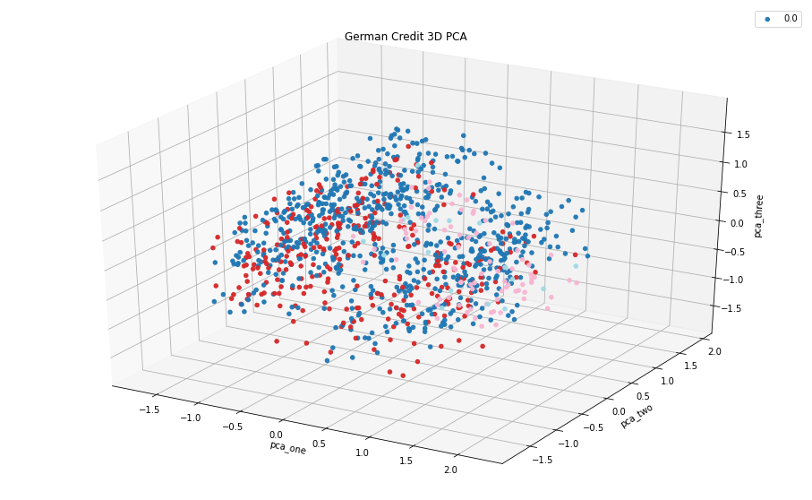
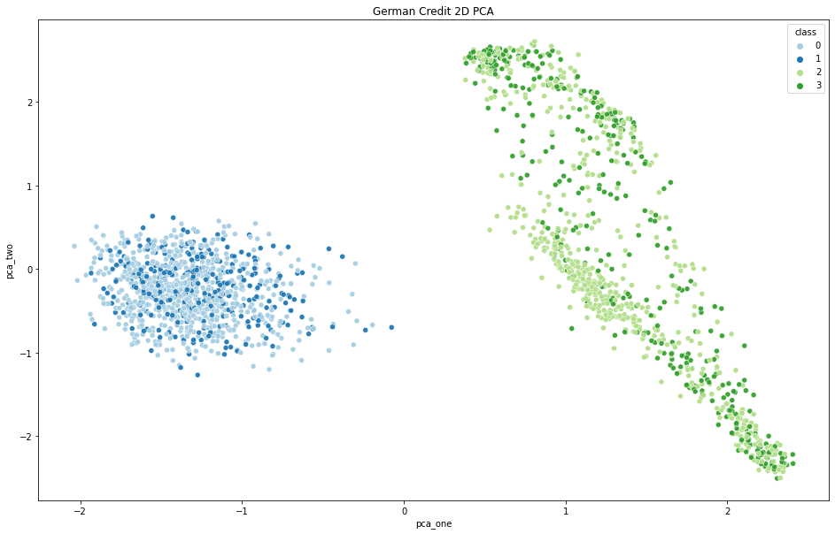
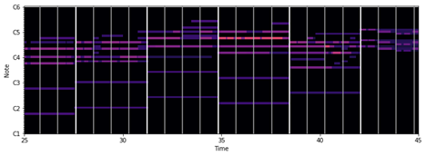
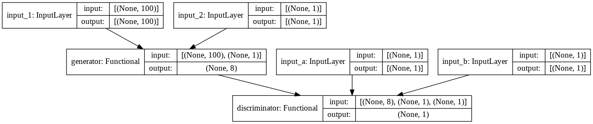
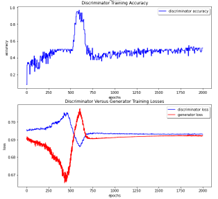
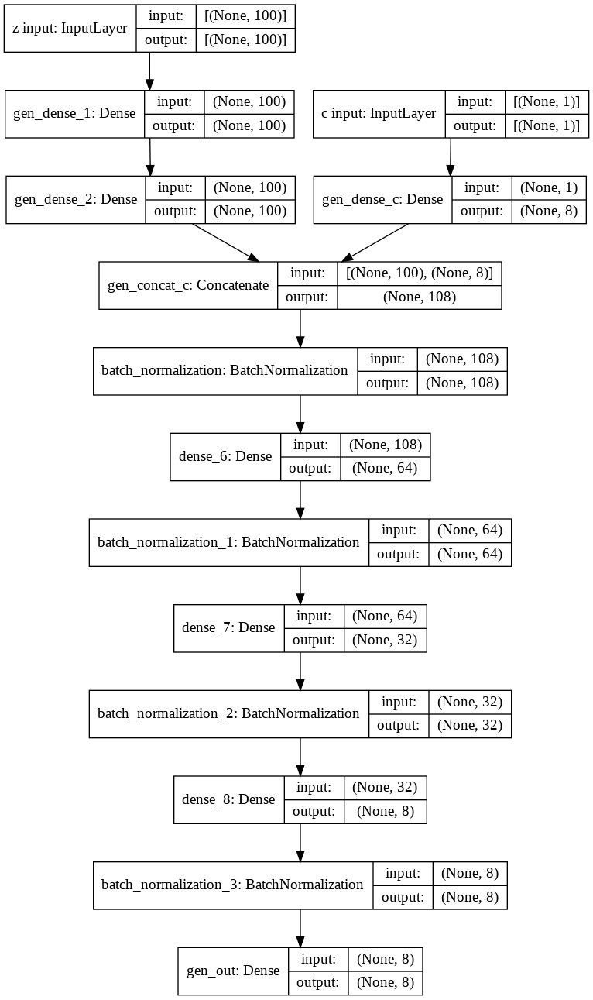
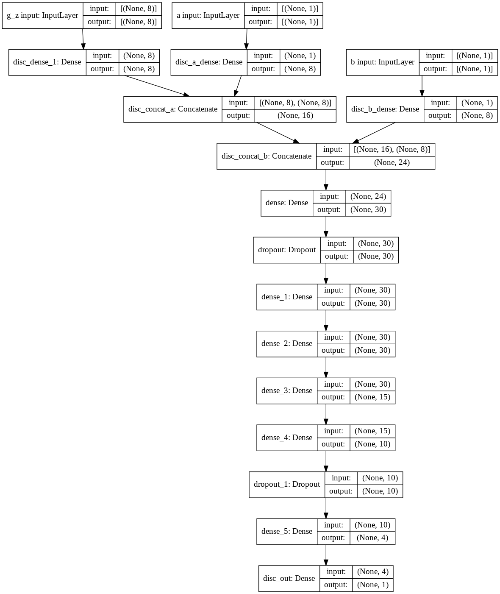
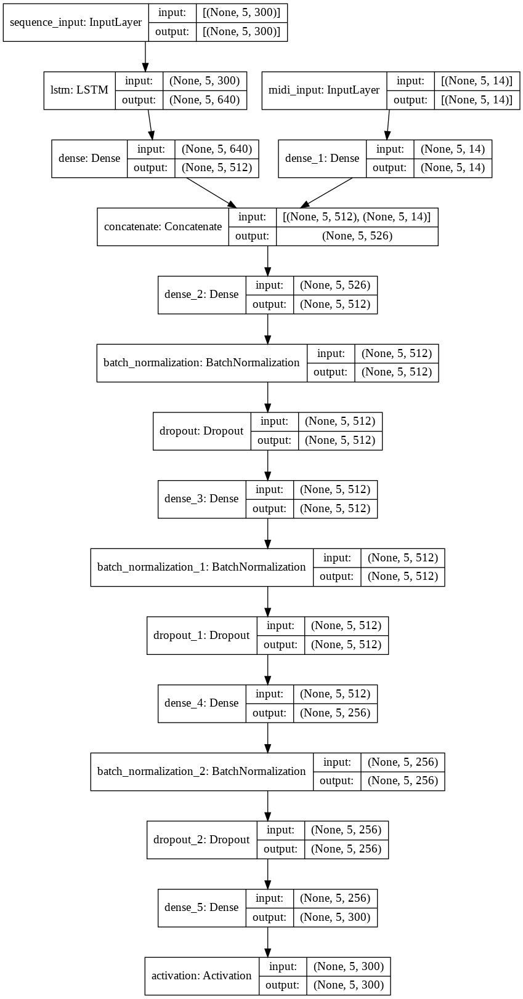
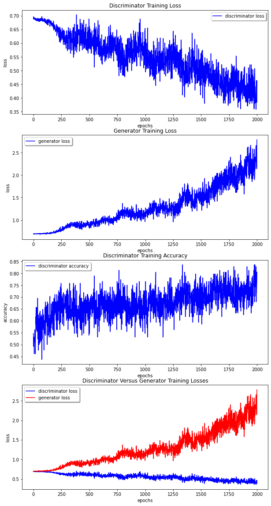

# Deep-Learning

This repository includes all four tasks notebooks created as part of the Deep Learning course at the Ben-Gurion University of the Negev.
Each project covers a different field: **ANN**, **CNN**, **RNN** and **GAN**.

Deep learning algorithms have recorded significant achievements in diverse areas such as image recognition, Text analysis and robotics. The course provides an overview of the areas and trends in the field of deep learning today. Opens An overview of the theoretical basis on which the field stands and then reviews the different types of networks that exist Today and their suitability for the various tasks. The course also discussed various issues related to the use of these algorithms For "real world" problems and in depth examples of applications in various fields. The beginings of the course was based on Coursera's course of **Andrew Ng. - "DeepLearning Specialization" ([link](https://www.coursera.org/specializations/deep-learning))** and covered all of its sylabus.

  
  
  

## Assignments

[Assignment 1](Assignments/Ass1.ipynb) - **ANN** - The purpose of the project was to build a simple neural network “from scratch” and to obtain a deep understanding of the forward/backward propagation process **(without using tensorflow or keras)**.

[Assignment 2](Assignments/Ass2_submission.ipynb) - **CNN** - Facial Recognition using One-shot Learning - The purpose of the task is to successfully execute a one-shot learning task for previously unseen objects, based on the paper [Siamese Neural Networks for One-shot Image Recognition](https://www.cs.cmu.edu/~rsalakhu/papers/oneshot1.pdf). Given two facial images of previously unseen persons, the architecture have to successfully determine whether they are the same person. We experimented with building a convolutional neural net and using it on a real-world dataset and problem.

[Assignment 3](Assignments/Ass3_LSTM_highRAM.ipynb) | [Report](Assignments/Assignment_3.pdf)- **RNN** - lyrics generation using RNNs - The purpose of this task was to build a recurrent neural net and use it on a real-world dataset. We trained a neural network to generate lyrics based on a provided melody. In addition to practical knowledge in the “how to” of building the network, an additional goal was to face the challenge of integrating different sources of information into a single framework.

[Assignment 4 Part 1](Assignments/Ass4_Part_1.ipynb) | [Assignment 4 Part 2](Assignments/Ass4_Part_2.ipynb) | [Report](Assignments/Assignment_4_-_Report.pdf)- **GAN** - Tabular samples generation - This work has two sections, the first one is an implementation of a simple GAN model for tabular data, and the second part is an implementaion of a modified GAN architecture that should infer the inner-working of a black-box model. 

  
  
  
  

<!---
  
  
  
  
--->

